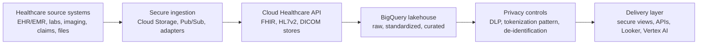

# Team Briefing: GCP Healthcare Landing Zone

This document explains the `gcp-healthcare-foundation` repository for team
review, onboarding, and production planning.

Repository:
[`AbhijeetKharat18/gcp-healthcare-foundation`](https://github.com/AbhijeetKharat18/gcp-healthcare-foundation)

## 1. Executive Summary

This repository is a Terraform-based Google Cloud foundation for healthcare
data workloads. It builds a secure landing zone first, then adds the healthcare
data platform on top.

The design follows a staged model:

1. Bootstrap the Terraform state and automation identity.
2. Create organization guardrails, folders, logging, and security monitoring.
3. Create per-environment base projects and encryption keys.
4. Create Shared VPC networking, firewall controls, Private Google Access, and
   VPC Service Controls.
5. Create workload projects for ingestion, healthcare core, lakehouse, and
   delivery.
6. Deploy healthcare data services: Cloud Healthcare API, BigQuery lakehouse,
   DLP, column-level security, row-level access pattern, and governed delivery
   views.
7. Add monitoring, alerting, SCC findings export, and operational dashboards.

The current repository is a production-style reference implementation. Real
production rollout still requires organization-specific IDs, billing, groups,
network ranges, Workload Identity Federation variables, and security approvals.

## 2. What This Landing Zone Solves

Healthcare platforms need more than a project and a VPC. They need repeatable
controls for PHI, auditability, restricted data movement, least-privilege
access, and secure analytics.

This repo provides:

- GCP organization structure for healthcare environments.
- Secure Terraform state with CMEK encryption.
- No service account key dependency for CI/CD.
- Organization policies for baseline guardrails.
- Immutable audit log retention.
- Shared VPC networking with private access to Google APIs.
- VPC Service Controls around sensitive healthcare services.
- Cloud Healthcare API stores for FHIR, HL7v2, and DICOM.
- BigQuery medallion lakehouse for raw, standardized, curated, de-identified,
  analytics, and secure-view layers.
- Cloud DLP templates for PHI detection and de-identification.
- Column-level security with Data Catalog policy tags.
- Governed delivery through `secure_views` instead of raw PHI access.
- Security monitoring for IAM, VPC-SC, service account keys, and KMS events.

## 3. Where Things Live

| Area | Location | Purpose |
|---|---|---|
| Bootstrap | `0-bootstrap/` | Seed project, Terraform state bucket, foundation service account, GitHub WIF |
| Organization controls | `1-org/` | Folders, org policies, audit archive, SCC export, contacts |
| Environment baseline | `2-environments/` | Per-env base projects, CMEK keys, budgets |
| Network foundation | `3-networks/` | Shared VPC, subnet ranges, restricted Google APIs, VPC-SC, optional HA VPN |
| Workload projects | `4-projects/` | Ingestion, healthcare-core, lakehouse, delivery projects per environment |
| Healthcare platform | `5-healthcare-workload/` | Healthcare API, BigQuery lakehouse, DLP, CLS/RLS, runtime IAM |
| Monitoring | `6-monitoring/` | Security metrics, alert policies, dashboards |
| Reusable modules | `modules/` | Shared Terraform modules for projects, networks, VPN, monitoring |
| Architecture diagrams | `docs/architecture/` | Visual roadmap diagrams |
| Compliance map | `docs/COMPLIANCE.md` | HIPAA/OIG/Texas HB 300 mapping |
| CI/CD | `.github/workflows/terraform.yml` | Terraform validation, plan, and apply workflow |

## 4. Architecture Flow

At a high level, the platform is built in layers:



Control layers wrap the whole flow:

- IAM and MFA through Google Cloud Identity / Workspace.
- Organization policies for guardrails.
- CMEK encryption for state, storage, Pub/Sub, and BigQuery.
- VPC Service Controls for sensitive services.
- Private Google Access and restricted Google APIs.
- Audit logs and immutable retention.
- Security Command Center findings and monitoring alerts.

## 5. How The Stages Work

The repo intentionally uses separate Terraform root modules instead of one huge
deployment. That makes the foundation easier to reason about and safer to
apply.

### Stage 0: Bootstrap

Creates the seed project, Terraform state bucket, KMS key, and Terraform service
account. This is run manually first by a human with org-level bootstrap access.

Why it matters:

- Terraform state can contain sensitive metadata.
- State is encrypted with a customer-managed key.
- Later stages run through impersonation instead of long-lived keys.
- GitHub Actions can use Workload Identity Federation after bootstrap is done.

### Stage 1: Organization

Creates organization folders, security policies, audit logging, SCC export, and
Essential Contacts.

Key controls:

- No service account key creation or upload.
- No default VPC networks.
- OS Login required.
- No VM external IPs.
- Resource location restriction.
- CMEK requirement for key services.
- Org-wide Cloud Audit Logs archive.

### Stage 2: Environments

Creates environment base projects for `dev`, `nonprod`, and `prod`.

Each environment gets:

- Base project.
- KMS keyring and key.
- Billing budget.

### Stage 3: Networks

Creates Shared VPC host projects and network controls.

Important controls:

- Custom-mode VPC.
- Private Google Access.
- Restricted Google APIs DNS.
- Deny-all egress pattern with explicit allows.
- VPC Service Controls perimeter per environment.
- Optional HA VPN to on-prem.

### Stage 4: Workload Projects

Creates the workload projects and attaches them to Shared VPC and VPC-SC.

Project pattern:

- `ingestion`
- `healthcare-core`
- `lakehouse`
- `delivery`

This keeps blast radius smaller than putting all workloads in one project.

### Stage 5: Healthcare Workload

Creates the actual healthcare data platform.

Main components:

- Cloud Healthcare API dataset.
- FHIR R4 store.
- HL7v2 store.
- DICOM store.
- Pub/Sub notifications.
- FHIR to BigQuery streaming.
- BigQuery medallion datasets.
- DLP inspect and de-identification templates.
- Data Catalog policy tags for column-level security.
- Authorized `secure_views` dataset for governed access.

### Stage 6: Monitoring

Creates security alerting and dashboards.

Monitored examples:

- IAM policy changes.
- VPC-SC violations.
- Service account key creation attempts.
- KMS key destruction scheduling.
- SCC active findings.

## 6. What Is New Or Interesting

This repo is not just “Terraform that creates projects.” The useful learning is
how cloud foundation controls and healthcare data controls connect.

Key learnings:

- **Landing zone before workload:** healthcare workloads should not start in an
  ad hoc project. The org, network, audit, IAM, and encryption controls come
  first.
- **State is part of the security boundary:** Terraform state is protected with
  CMEK and a dedicated state bucket.
- **No long-lived CI keys:** GitHub Actions uses Workload Identity Federation
  instead of storing a service account key.
- **VPC-SC is central for PHI:** sensitive services are wrapped in per-env
  service perimeters.
- **Raw PHI and delivery are separated:** delivery identities read governed
  `secure_views`, not raw datasets.
- **Security is layered:** org policies, IAM, CMEK, network controls, DLP,
  audit logs, and monitoring all work together.
- **Not everything is Terraform:** Healthcare API CMEK and some process
  controls require out-of-band operational steps and validation.

## 7. How To Demo This To The Team

Suggested walkthrough:

1. Start with `docs/architecture/ROADMAP.md`.
2. Explain the seven stages in `README.md`.
3. Open `0-bootstrap/` and show how state and automation identity are created.
4. Open `1-org/` and show organization policies plus audit logging.
5. Open `3-networks/` and explain restricted APIs, Shared VPC, and VPC-SC.
6. Open `5-healthcare-workload/` and show Healthcare API, BigQuery, DLP, and
   secure views.
7. End with `docs/COMPLIANCE.md` to map the technical controls to HIPAA/OIG/HB
   300 concepts.

Simple explanation to use:

> This repo builds a secure GCP foundation for healthcare data. It starts with
> organization guardrails, encryption, audit logging, networking, and VPC
> Service Controls. Then it adds healthcare-specific data services like Cloud
> Healthcare API, BigQuery lakehouse layers, DLP de-identification, and governed
> secure views. The goal is to give teams a repeatable path from raw PHI intake
> to controlled analytics and delivery.

## 8. Current Readiness Status

Ready now:

- Repository structure is clean and staged by deployment concern.
- Terraform validate passes for the main stages.
- GitHub Actions validates Terraform on push.
- The architecture diagrams and compliance mapping are included.
- Sensitive values are represented as variables or examples.
- Real `.tfvars` files and credential files are ignored.

Still required before production:

- Replace placeholder org, billing, group, CIDR, and contact values.
- Apply `0-bootstrap` in the target GCP organization.
- Configure GitHub Actions variables from bootstrap outputs.
- Confirm Workload Identity Federation and production environment approval.
- Run `terraform plan` against the real org.
- Validate Healthcare API CMEK process.
- Validate VPC-SC perimeter behavior with real users and services.
- Add application runtime deployments for ingestion adapters, Dataflow jobs,
  Cloud Run APIs, and downstream analytics.
- Complete HIPAA risk assessment, BAA review, incident response procedures, and
  operational runbooks.

## 9. Path To Production

### Phase 1: Foundation Decisions

Decide and document:

- GCP organization ID.
- Billing account.
- Project prefix.
- Environment names.
- Region and residency requirements.
- Admin groups and break-glass groups.
- Security contact email.
- Trusted corporate IP ranges.
- On-prem connectivity requirements.

### Phase 2: Bootstrap

Run `0-bootstrap` manually.

Outputs to capture:

- `tfstate_bucket`
- `terraform_sa_email`
- `wif_provider_name`
- `seed_project_id`
- `tfstate_kms_key`

Then configure GitHub Actions variables:

- `TF_STATE_BUCKET`
- `GCP_SERVICE_ACCOUNT`
- `GCP_WIF_PROVIDER`

### Phase 3: Foundation Apply

Apply stages in order:

```bash
for s in 1-org 2-environments 3-networks 4-projects 5-healthcare-workload 6-monitoring; do
  ( cd $s && terraform init && terraform plan && terraform apply )
done
```

For production, apply through reviewed CI/CD instead of a local terminal once
bootstrap and WIF are working.

### Phase 4: Security Validation

Validate:

- Service account key creation is blocked.
- VMs cannot use external IPs.
- Restricted APIs resolve through private Google access.
- VPC-SC blocks data exfiltration paths.
- Audit logs arrive in the immutable archive bucket.
- SCC findings export to Pub/Sub.
- DLP templates detect expected PHI samples.
- Delivery service accounts cannot read raw PHI.

### Phase 5: Workload Integration

Add the compute layer:

- MLLP adapter on GKE or equivalent.
- File ingestion jobs into Cloud Storage.
- Dataflow / Apache Beam harmonization pipelines.
- DLP de-identification pipelines.
- Cloud Run or API Gateway delivery layer.
- Looker / Looker Studio dashboards.
- Vertex AI feature and model workflows, using de-identified or governed data.

### Phase 6: Production Operations

Before go-live:

- Create runbooks for incident response, key rotation, backup/restore, and
  access reviews.
- Schedule regular IAM and VPC-SC reviews.
- Confirm audit retention period with compliance/legal.
- Test disaster recovery and state restore.
- Confirm alert routing and on-call ownership.
- Document emergency access and break-glass approval.

## 10. Known Gaps To Discuss

These are not defects in the concept, but they need owner decisions before
production:

- The Terraform foundation service account is powerful; production may split it
  by stage or use narrower custom roles.
- Healthcare API dataset CMEK is documented as an out-of-band step due provider
  limitations and must be validated in the target org.
- The example row-level security view is off by default because real curated
  tables do not exist yet.
- The repo creates the platform foundation, not the full application runtime.
- Real HIPAA compliance requires process controls, not only infrastructure.
- VPC-SC can break expected workflows if access levels and perimeter bridges
  are not tested carefully.

## 11. Team Roles

| Role | Responsibility |
|---|---|
| Cloud platform team | Terraform foundation, networking, IAM, CI/CD |
| Security team | Org policies, VPC-SC, SCC, audit, incident response |
| Compliance team | HIPAA/HB 300/OIG mapping, risk assessment, BAA review |
| Data engineering | FHIR/HL7/DICOM pipelines, BigQuery modeling, DLP workflows |
| App/API team | Cloud Run/API Gateway delivery services |
| Analytics/ML team | Secure views, Looker dashboards, Vertex AI use cases |
| Operations | Monitoring, alert routing, runbooks, change management |

## 12. Suggested Team Discussion Questions

- Which environment should be deployed first: dev only, or dev plus nonprod?
- What is the approved production region and data residency scope?
- Who owns the break-glass group and approval process?
- What systems will feed FHIR, HL7v2, DICOM, batch files, and claims data?
- What data is allowed in raw PHI, curated PHI, de-identified, and analytics
  marts?
- Which teams need access to secure views, and how will access be approved?
- What SIEM or incident response tool should receive SCC findings and alerts?
- What is the production go-live acceptance checklist?

## 13. Bottom Line

This repository gives the team a strong starting point for a healthcare-focused
GCP landing zone. It demonstrates the right control pattern: secure foundation
first, healthcare data services second, governed delivery last.

To take it to production, the team should treat this as a reference
implementation that needs real environment values, reviewed CI/CD
configuration, live Terraform plans, security validation, and operational
processes around the infrastructure.
